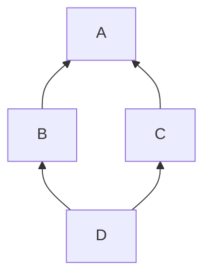
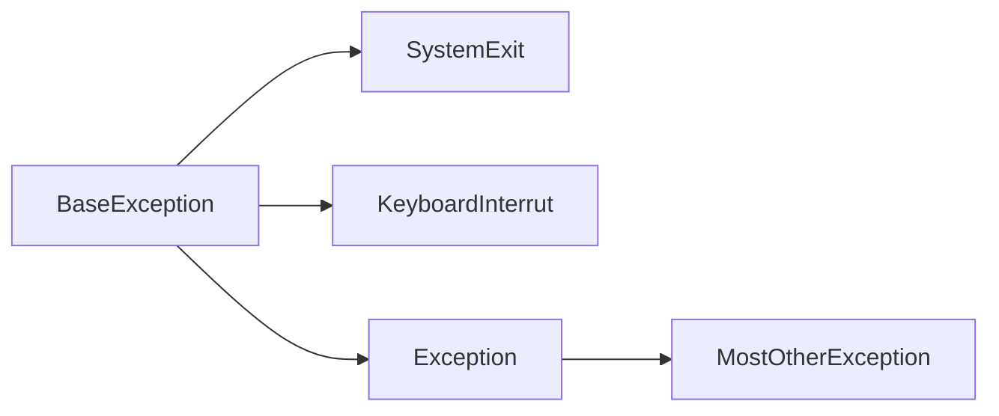

# python3面向对象编程（第二版）

Dusty Phillips著作

## Chapt3 对象相似时

- 基本的继承
- 从内置类继承
- 多重继承
- 多态与鸭子类型

#### 钻石型继承问题

问题：多继承时，需要初始化多个父类的初始化方法，且父类的参数都不相同。

方法1： 直接在子类依次调用父类的初始化方法，完成对所有继承的父类__init__()
潜在隐患：
1. 参数过多，容易遗漏而出现父类初始化失败
2. 类层级的组织可能导致超类被多次调用。如下图，(由于mermaid格式限制无法使用别的箭头)，整体像一个钻石，所以简称为钻石继承。D在初始化BC时，A会被初始化两次，这会带来很大问题。**super**方法可以解决这个问题，它保证了钻石继承时，其他中间级别的类在子类传参初始化时，不会再调用它的父类，而是同级类，比如先初始化B，A也被初始化一次了，然后C初始化时A不会被调用，而是B被当成C的父类。



**tips**: <font color="#123499">方法的调用顺序可以通过修改类的__mro__（Method Resolution Order）属性进行动态修改。</font>

#### 鸭子类型

维基百科中对鸭子类型：
在程序设计中，鸭子类型（英语：duck typing）是动态类型的一种风格。在这种风格中，一个对象有效的语义，不是由继承自特定的类或实现特定的接口，而是由当前方法和属性的集合决定。这个概念的名字来源于由James Whitcomb Riley提出的鸭子测试，“鸭子测试”可以这样表述：
“当看到一只鸟走起来像鸭子、游泳起来像鸭子、叫起来也像鸭子，那么这只鸟就可以被称为鸭子。”
在鸭子类型中，关注的不是对象的类型本身，而是它是如何使用的。例如，在不使用鸭子类型的语言中，我们可以编写一个函数，它接受一个类型为鸭的对象，并调用它的走和叫方法。在使用鸭子类型的语言中，这样的一个函数可以接受一个任意类型的对象，并调用它的走和叫方法。如果这些需要被调用的方法不存在，那么将引发一个运行时错误。任何拥有这样的正确的走和叫方法的对象都可被函数接受的这种行为引出了以上表述，这种决定类型的方式因此得名。
鸭子类型通常得益于不测试方法和函数中参数的类型，而是依赖文档、清晰的代码和测试来确保正确使用。从静态类型语言转向动态类型语言的用户通常试图添加一些静态的（在运行之前的）类型检查，从而影响了鸭子类型的益处和可伸缩性，并约束了语言的动态特性。

## Chapt4 异常捕获



## Chapt 8 字符串与序列化

#### 序列化对象

python的pickle模块
dump() 导出文件对象,dumps() 导出bytes对象 
load() 加载文件对象,loads() 导出bytes对象

> 除此之外, 一些有时间有关的属性无法使用pickle序列化，比如打开的网络套接字

> json也是一种不错的格式，常见wheel包括json，jsonnet

## chapt9 迭代器模式

python中迭代器自带next(), done()方法，分别表示迭代到下一个元素和是否遍历完。

#### 推导

**列表生成式**

例子，可以用[]或{}包裹生成式
```
input_strings=['1','2','23','11111']
output=[int(n) for n in input_strings]
```

注意和**生成器表达式**的区别，它不会创建容器对象且用()包裹
```
warning = (1 for m in infile if 'WARNING' in m)
```

还有**生成器**
````
warning=(m.replace('\tWARNING','') for m in infile if 'WARNING' in m)
````
*yield*不同于return其实是创建了一个新的对象，且每次执行函数时不是从函数头开始，而是从yield语句下一行开始，其他和return一样。

#### 协程
表面上给生成器多了一个send()方法，但是后面的线程调度，尤其是对于多线程和并发是完全不同于之前的表现。


## Chapt13 并发

- 线程 
    参考 example1.py
> 注意thread的run() 和start()的区别，前者只会调用一个线程，后者是并发

- 多进程

    参考 example2.py

- Future

提供异步编程的API，效果比手动处理线程更好

- AsyncIO

当前最先进的并发编程方法，集成了Future的概念，事件循环和协程。专为网络IO设计。
